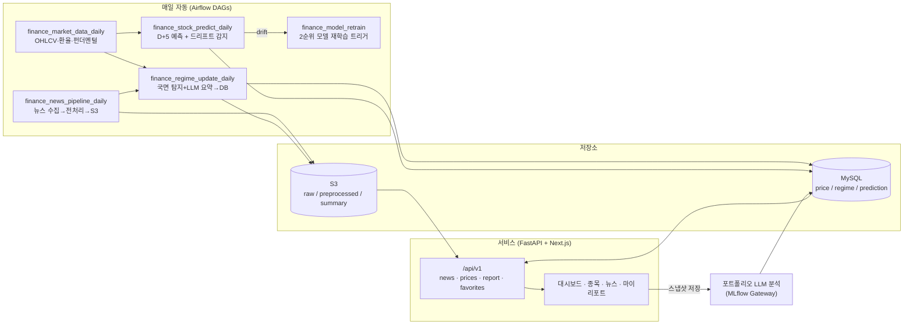

# [우리FISA 6기] AI 엔지니어링 과정 4팀 (WHAI)

## 1. 프로젝트 개요

- **주제** : **WHAI** — 국면(Regime) 기반 주가 예측 + LLM 뉴스 근거 분석 개인화 투자 도우미
- **프로젝트 기획 배경** :
개인 투자자는 “주가가 왜 움직였는가”와 “앞으로 어떻게 될 것인가”를 한 화면에서 보기 어렵습니다. 수치 예측만 제공하는 서비스는 근거가 빈약하고, 뉴스만 모아주는 서비스는 가격 흐름과 연결되지 않습니다. WHAI는
1. 종목별 주가 **국면(상승/하락 구간)을 자동 탐지**하고, 
2. 각 국면의 **이동 원인을 뉴스 원문 직인용 근거와 함께 LLM이 설명**하며, 
3. KOSPI200 종목에 대한 **D+5 주가 예측**과 
4. 보유 포트폴리오에 대한 **투자 성향 맞춤 LLM 종합 분석**을 하나의 서비스로 통합했습니다. 모든 LLM 출력은 환각을 억제하기 위해 Structured Output 스키마 검증과 원문 교차검증을 거칩니다.
- **기술 스택** :
    
    
    | 레이어 | 기술 |
    | --- | --- |
    | Language | Python 3.12 |
    | Frontend | Next.js 16 (App Router) · React 19 · Tailwind CSS 4 |
    | Backend | FastAPI · SQLAlchemy · slowapi(rate limit) · JWT 인증 |
    | LLM / Agent | MLflow Gateway → OpenRouter(Claude · OpenAI) · MLflow Prompt Registry · MLflow Tracing(토큰/비용 추적) |
    | ML 모델 | LightGBM · XGBoost · ExtraTrees · ElasticNet · Huber · PatchTST(Transformer) · Markov Switching AR(국면 탐지) |
    | Pipeline | Apache Airflow (CeleryExecutor + Redis) |
    | Data | Aiven MySQL(서비스 DB) · AWS S3(뉴스·모델 아티팩트) ·  pykrx / FinanceDataReader |
    | Infra / CI·CD | Docker · AWS EC2 Ubuntu 24.04.4 LTS   · AWS ECR · GitHub Actions · MLflow(Postgres backend),  |

## 2. 아키텍쳐

### 2-1. 시스템 아키텍쳐


### 설명

사용자는 EC2의 Docker 네트워크에서 동작하는 **Next.js 프론트엔드(:80)** 에 접속하고, 프론트는 `/api/v1` 경로로 **FastAPI 백엔드**를 호출합니다. 백엔드는 서비스 데이터(회원·포트폴리오·국면·예측)를 **Aiven MySQL**에서 읽고, 포트폴리오 LLM 분석이 필요할 때 **MLflow Gateway**를 통해 OpenRouter LLM을 호출합니다. 데이터·모델 파이프라인은 **Airflow**가 매일 자동 실행하여 뉴스 수집 → 전처리(S3) → 국면 탐지 → LLM 요약 → DB 적재, 그리고 D+5 주가 예측을 수행합니다. **MLflow**는 LLM 게이트웨이·프롬프트 레지스트리·토큰/비용 트레이싱을 담당하며 아티팩트는 S3, 메타데이터는 Postgres에 저장합니다. 코드가 main에 머지되면 **GitHub Actions**가 테스트·이미지 빌드 후 **ECR**에 푸시하고 EC2가 이를 pull 하여 배포됩니다.

### 2-2. AI 에이전트 워크플로우

```mermaid
---
title: LLM Workflow (whai)
---
flowchart LR
 subgraph CORE["🧩 공유 LLM 코어 · src/llm_utils"]
    direction TB
        PROMPT["프롬프트 로드<br>prompt_registry / prompt_loader<br>MLflow Prompt Registry 우선<br>실패 시 로컬 YAML fallback"]
        GW["GatewayClient.call_with_usage<br>gateway_client.py<br>POST /chat/completions<br>(httpx · Basic Auth)"]
        GATEWAY{{"MLflow Gateway REST API<br>52.78.237.104:5001"}}
        OR(("OpenRouter<br>Claude 모델 라우팅"))
        TOK["TokenTracker<br>토큰·비용 집계"]
        MLF["MLflowLogger<br>run/params/metrics<br>@mlflow.trace + span"]
  end
 subgraph F1["📈 Flow 1 · 국면×뉴스 요약 배치 (script/llm/regime_news_summary_pipeline.py)"]
    direction TB
        F1A["① regime 테이블 조회<br>RegimeDBLoader<br>종목별 상승/하락 국면 목록"]
        F1B["② 국면 구간 뉴스 로드<br>S3 preprocessed_final/<br>중복 제거 + 컨텍스트 빌드"]
        F1C["③ 종목 메타 조회<br>asset 테이블 / fallback 매핑<br>종목명·섹터"]
        F1D["④ regime_analysis 프롬프트 렌더<br>국면·수익률·변동성·뉴스 주입"]
        F1E["⑤ LLM 요약 호출 + 재시도<br>low_performance_llm · 최대 3회<br>JSON 파싱 + 필수키 검증"]
        F1F["⑥ S3 저장<br>summary/{ticker}/{start}_{end}.json"]
  end
 subgraph F2["💼 Flow 2 · 포트폴리오 실시간 분석 (src/llm_utils/portfolio_analyzer.py)"]
    direction TB
        F2A["① 보유 종목 집계<br>비중·진입가·현재가·손익·섹터·총수익률"]
        F2B["② 종목별 최근 30일 국면 뉴스 조회<br>S3 summary/ (Flow 1 산출물)"]
        F2C["③ 투자성향 조회<br>user.invest_type (개인화)"]
        F2D["④ portfolio_analysis 프롬프트 렌더<br>holdings payload 구성 (PII 제외)"]
        F2E["⑤ LLM 종합 분석 호출<br>mid_performance_llm"]
        F2F["⑥ 관련 최신 뉴스 검색<br>news_evidence_client<br>OpenRouter web_search 직접 호출<br>annotation 교차검증"]
        F2G["⑦ JSON 파싱 후 반환<br>실패 시 graceful degrade → NULL"]
  end
 subgraph F3["🧪 Flow 3 · 요약 품질 평가 (script/llm/news_summary_pipeline.py --mode evaluation)"]
    direction TB
        F3A["① 뉴스 샘플링"]
        F3B["② 레퍼런스 요약 생성<br>mid_performance_llm"]
        F3C["③ 프로덕션 요약 생성<br>low_performance_llm"]
        F3D["④ 비교 평가<br>evaluation_engine<br>ROUGE · BERTScore · 정성 점수"]
        F3E["⑤ MLflow evaluation 등록"]
  end
 subgraph F4["⏱️ Flow 4 · 변동요인 일배치 (airflow/dags/finance_factor_insights_daily.py)"]
    direction TB
        F4A["① 선행 DAG 완료 대기<br>regime_news_summary_daily<br>ExternalTaskSensor"]
        F4B["② 12개 종목 변동요인 LLM 분석<br>종목별 개별 실패 허용"]
        F4C["③ MySQL factor_insight UPSERT<br>멱등 (ticker+date 중복 스킵)"]
  end
 subgraph JUDGE["⚖️ MLflow UI · LLM-as-Judge"]
    direction TB
        JSAMP["트레이스 샘플링<br>흐름마다 표본 기준·비율 상이"]
        JLLM["고성능 LLM 심판 호출<br>각 흐름 운영 LLM보다 상위 티어<br>(상황에 맞게 선택)"]
        JSCORE["품질 점수/판정 기록<br>MLflow Evaluation · Assessment"]
  end
    PROMPT --> GW
    GW --> GATEWAY & TOK & MLF
    GATEWAY --> OR
    OR -. 응답(JSON) .-> GW
    GATEWAY --- TIER["엔드포인트 티어<br>low_performance_llm · mid_performance_llm<br>high_performance_llm"]
    F1A --> F1B
    F1B --> F1C
    F1C --> F1D
    F1D --> F1E & PROMPT
    F1E --> F1F & GW
    F2A --> F2B
    F2B --> F2C
    F2C --> F2D
    F2D --> F2E & PROMPT
    F2E --> F2F & GW
    F2F --> F2G
    F3A --> F3B
    F3B --> F3C & GW
    F3C --> F3D & GW
    F3D --> F3E
    F4A --> F4B
    F4B --> F4C & GW
    JSAMP --> JLLM
    JLLM --> JSCORE
    F1E -. Flow1 표본 .-> JSAMP
    F2E -. Flow2 표본 .-> JSAMP
    F3E -. Flow3 표본 .-> JSAMP
    F4B -. Flow4 표본 .-> JSAMP
    MLF -. 트레이스 적재 .-> JSAMP
    F1F -. summary/ 재사용 .-> F2B
    F1F -. 선행 산출물 .-> F4A

     PROMPT:::core
     GW:::gw
     GATEWAY:::gw
     OR:::gw
     TOK:::core
     MLF:::core
     TIER:::gw
     F1A:::step
     F1B:::step
     F1C:::step
     F1D:::step
     F1E:::llm
     F1F:::store
     F2A:::step
     F2B:::step
     F2C:::step
     F2D:::step
     F2E:::llm
     F2F:::llm
     F2G:::step
     F3A:::step
     F3B:::llm
     F3C:::llm
     F3D:::step
     F3E:::step
     F4A:::step
     F4B:::llm
     F4C:::step
     JSAMP:::judge
     JLLM:::llm
     JSCORE:::judge
    classDef core fill:#1f2937,stroke:#60a5fa,stroke-width:2px,color:#f9fafb
    classDef gw fill:#0f766e,stroke:#5eead4,stroke-width:2px,color:#ecfeff
    classDef step fill:#f8fafc,stroke:#94a3b8,stroke-width:1px,color:#0f172a
    classDef llm fill:#fef3c7,stroke:#d97706,stroke-width:2px,color:#7c2d12
    classDef store fill:#ede9fe,stroke:#7c3aed,stroke-width:1px,color:#3b0764
    classDef judge fill:#fee2e2,stroke:#dc2626,stroke-width:2px,color:#7f1d1d
```



### 설명

에이전트는 단순 1회 호출이 아니라 **탐지 → 수집 → 추론 → 검증 → 재시도**의 루프로 동작합니다. 먼저 가격 시계열을 로그수익률 기준으로 상승/하락 국면으로 나누고 단기 노이즈 구간을 병합한 뒤, 각 구간의 뉴스(구간 ±1일)를 S3에서 모읍니다. MLflow Prompt Registry에서 프롬프트를 불러와 게이트웨이로 LLM을 호출하며, 이때 `mlflow.start_span`으로 입력/출력 토큰을 추적합니다. 응답은 **JSON 스키마(cause·evidence·confidence 등) 검증**을 거치고, 파싱 실패나 필수 키 누락 시 `tenacity` 지수 백오프로 최대 3회 재시도합니다. evidence의 인용문은 반드시 뉴스 **원문에서 직접 인용**하고 수치를 원문 그대로 보존하도록 강제해 환각을 차단합니다. 별도의 **포트폴리오 분석 에이전트**는 보유 종목 집계·국면 뉴스·투자 성향을 묶어 종합 코멘트를 생성하고, `news_evidence_client`가 OpenRouter 웹검색 결과를 인용 URL과 교차검증하여 신뢰할 수 있는 근거 링크만 덧붙입니다.

## 3. 주요 기능 소개

### 3-1. 핵심 기술 구성

1. **국면(Regime) 자동 탐지 + LLM 원인 분석** — 주가 시계열을 상승/하락 구간으로 분할하고, 각 구간의 이동 원인을 뉴스 기반으로 LLM이 설명. 모든 근거는 원문 직인용·수치 보존으로 환각을 억제.
2. **국면 피처를 결합한 종목별 맞춤 D+5 예측** — Markov Switching AR로 산출한 국면 확률/지속일을 피처로 추가하고, 종목 특성에 맞춰 트리·선형·PatchTST 모델을 종목별로 선택(10종목, 신한지주 MAPE 2.36%).
3. **MLflow Gateway + Prompt Registry 기반 LLM 운영** — 프롬프트를 코드와 분리해 레지스트리에서 버전 관리하고, 게이트웨이로 모델/키를 추상화하며, 토큰·비용을 Tracing으로 자동 기록.
4. **투자 성향 맞춤 포트폴리오 종합 분석** — 보유 비중·손익·섹터·국면 뉴스와 투자 성향(안정형~공격투자형)을 결합해 종목별 코멘트·리스크 정합성·제안을 생성하고, 웹검색 근거 링크를 교차검증해 첨부.
5. **Airflow 완전 자동화 일일 파이프라인** — 뉴스 수집·전처리·국면 요약·시장데이터·D+5 예측·드리프트 감지/재학습을 DAG로 오케스트레이션하여 매일 무인 갱신.

### 3-2. 통합 워크플로우 다이어그램



### 3-3. 세부 기능 소개

### 국면 탐지 + LLM 뉴스 근거 분석

- 기능 설명 : 종목 가격을 상승/하락 국면으로 분할하고(노이즈 병합 포함), 각 국면의 뉴스를 모아 MLflow Gateway LLM으로 이동 원인을 분석합니다. `mlflow.start_span`으로 토큰을 추적하고, 응답을 JSON으로 파싱·검증하며 실패 시 `tenacity`로 재시도합니다.
- 핵심 코드(스크립트) :
    
    ```python
    @retry(stop=stop_after_attempt(3), wait=wait_exponential(multiplier=1, min=2, max=10))
    def _analyze_regime_with_llm(self, regime_info, news_context, endpoint="mid_performance_llm"):
        prompt_context = {
            "start": regime_info["start_str"], "end": regime_info["end_str"],
            "name": self.ticker_name, "code": self.ticker_code,
            "direction": regime_info["direction"], "vol_trend": regime_info["vol_trend"],
            "sector": self.sector, "news_context": news_context,
        }
        with mlflow.start_span(name="regime_analysis_llm") as span:
            prompt, prompt_uri = self.prompt_registry.format_prompt(self.prompt_key, **prompt_context)
            span.set_attributes({"mlflow.promptUri": prompt_uri, "endpoint": endpoint})
    
            gateway_client = GatewayClient(endpoint=endpoint, validate_connection=False)
            response, input_token, output_token = gateway_client.call_with_usage(text=prompt, max_tokens=1200)
    
            text = response.strip()
            s, e = text.find("{"), text.rfind("}") + 1   # JSON 구간 추출
            answer = json.loads(text[s:e])               # Structured Output 파싱
            return answer, input_token, output_token
    ```
    
- 코드 링크(스크립트 링크) : https://github.com/hwan1111/whai/blob/main/script/llm/regime_news_summary.py

### 종목별 D+5 주가 예측 (국면 피처 결합)

- 기능 설명 : 9개 기본 피처(수익률·거래량·KOSPI/S&P500/NASDAQ/환율/VIX)에 Markov Switching AR로 산출한 국면 확률·지속일·전환 피처를 더해 D+5 로그수익률을 예측합니다. 국면 기반 Walk-forward 폴드와 2단계 decay 가중치, Optuna(Rank IC) 탐색으로 종목별 최적 모델을 선택합니다.
- 핵심 코드(스크립트) :
    
    ```python
    # Markov Switching AR (k=2) 기반 국면 확률 피처
    res = MarkovAutoregression(ret_1d, k_regimes=2, order=1,
                               switching_ar=False, switching_variance=True).fit()
    bull_state = np.argmax([avg_ret_regime_0, avg_ret_regime_1])
    df["regime_prob"]     = res.filtered_marginal_probabilities[:, bull_state]
    df["regime_duration"] = current_regime_run_length
    df["regime_change"]   = regime_switch_flag
    df["target"]          = np.log(df["close"].shift(-5) / df["close"])  # D+5 로그수익률
    
    # 종목별 최종 모델 추론 (예: 신한지주 XGBRegressor, MAPE 2.36%)
    with open("data/saved_models/final/055550.pkl", "rb") as f:
        model = pickle.load(f)
    log_return_d5  = model.predict(np.nan_to_num(X))[0]
    predicted_price = current_price * np.exp(log_return_d5)
    ```
    
- 코드 링크(스크립트 링크) : https://github.com/hwan1111/whai/blob/main/docs/model_summary.md (모델 상세) · https://github.com/hwan1111/whai/blob/main/model/주가예측모델

### 투자 성향 맞춤 포트폴리오 LLM 종합 분석

- 기능 설명 : 마이리포트에서 포트폴리오 스냅샷을 저장하면, 종목별 비중·진입가·현재가·손익·섹터 구성과 투자 성향(invest_type), 종목별 최근 30일 국면 뉴스를 종합해 LLM이 분석합니다. 본문은 게이트웨이로 생성하고, 관련 최신 뉴스 링크는 OpenRouter 웹검색 인용을 교차검증해 환각 링크를 거릅니다. 분석 실패 시에도 스냅샷 저장은 보존되도록 graceful degrade 처리됩니다.
- 핵심 코드(스크립트) :
    
    ```python
    # backend/routers/report.py — 스냅샷 저장 시 LLM 분석 (실패해도 저장은 성공)
    ai_analysis_json = None
    try:
        analysis = portfolio_analyzer.analyze_portfolio(user_id, body.holdings, db)
        if analysis is not None:
            ai_analysis_json = json.dumps(analysis, ensure_ascii=False)
    except Exception as e:
        logger.error("AI 포트폴리오 분석 실패 (스냅샷은 그대로 저장):%s", e)
    
    # src/llm_utils/portfolio_analyzer.py — 본문 생성 후 근거 뉴스 교차검증
    with mlflow.start_span(name="portfolio_analysis") as span:
        ...
        missing = REQUIRED_KEYS - parsed.keys()     # overall_summary, per_holding, risk_alignment ...
    sources = find_news_evidence(evidence_holdings, analysis=analysis)  # OpenRouter 인용 URL 검증
    ```
    
- 코드 링크(스크립트 링크) : https://github.com/hwan1111/whai/blob/main/src/llm_utils/portfolio_analyzer.py · https://github.com/hwan1111/whai/blob/main/backend/routers/report.py

### MLflow Gateway + Prompt Registry LLM 운영

- 기능 설명 : 모든 LLM 호출은 MLflow Gateway 엔드포인트(`mid_performance_llm` / `low_performance_llm` 등)를 통해 OpenRouter로 라우팅되어 모델·API 키가 코드에서 분리됩니다. 프롬프트는 MLflow Prompt Registry에서 버전 관리(로컬 YAML fallback)되고, 호출별 입력/출력 토큰과 비용이 Tracing으로 기록됩니다.
- 핵심 코드(스크립트) :
    
    ```python
    # src/llm_utils/gateway_client.py
    class GatewayClient:
        """MLflow Gateway REST API 클라이언트 (로컬 → Gateway → OpenRouter)"""
        def __init__(self, endpoint="mid_performance_llm", validate_connection=True):
            self.gateway_uri = os.getenv("MLFLOW_GATEWAY_URL", ...)
            self.endpoint = endpoint
        def call_with_usage(self, text, max_tokens=512):
            # /gateway/{endpoint}/invocations 호출 후 (응답, input_token, output_token) 반환
            ...
    ```
    
- 코드 링크(스크립트 링크) : https://github.com/hwan1111/whai/blob/main/src/llm_utils/gateway_client.py · https://github.com/hwan1111/whai/blob/main/src/llm_utils/prompt_registry.py

### Airflow 일일 자동화 파이프라인

- 기능 설명 : 시장 데이터 동기화, 뉴스 수집·전처리·국면 요약, D+5 예측 및 드리프트 감지/재학습을 DAG로 오케스트레이션합니다. 예측 DAG는 rolling 20거래일 MAPE로 드리프트를 감지하면 2순위 모델로 재예측하고 필요 시 재학습 DAG를 트리거합니다.
- 핵심 코드(스크립트) :
    
    ```python
    # airflow/dags/finance_stock_predict_daily.py (06:30 UTC = 15:30 KST)
    # 흐름: predict_and_save (×10 병렬)
    #   1. 1순위 모델로 D+5 예측
    #   2. MySQL JOIN으로 rolling 20거래일 MAPE 계산 → 드리프트 감지
    #   3. 드리프트 시 2순위 모델로 재예측
    #   4. CI(80%, z=1.28) 계산 → forecast_json 구성
    #   5. prediction 테이블 UPSERT
    ```
    
- 코드 링크(스크립트 링크) : https://github.com/hwan1111/whai/tree/main/airflow/dags
