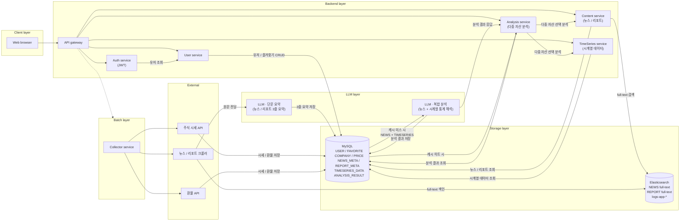

```mermaid
flowchart LR
 subgraph CLIENT["Client layer"]
        WEB["Web browser"]
  end
 subgraph BACKEND["Backend layer"]
        GW["API gateway"]
        AUTH["Auth service
    (JWT)"]
        USER_SVC["User service"]
        CONTENT_SVC["Content service
    (뉴스 / 리포트)"]
        TIMESERIES_SVC["TimeSeries service
    (시계열 데이터)"]
        ANALYSIS_SVC["Analysis service
    (다중 자산 분석)"]
  end
 subgraph BATCH["Batch layer"]
        COLLECT_SVC["Collector service"]
  end
 subgraph EXTERNAL["External"]
        STOCK_API["주식 시세 API"]
        EXCHANGE_API["환율 API"]
        NEWS_API["뉴스 / 리포트 크롤러"]
  end
 subgraph LLM_LAYER["LLM layer"]
        LLM_SUMMARIZE["LLM · 단문 요약
    (뉴스 / 리포트 3줄 요약)"]
        LLM_COMPOSITE["LLM · 복합 분석
    (뉴스 + 시계열 통계 해석)"]
  end
 subgraph STORAGE["Storage layer"]
        MYSQL[("MySQL
    USER / FAVORITE
    COMPANY / PRICE
    NEWS_META / REPORT_META
    TIMESERIES_DATA
    ANALYSIS_RESULT")]
        ES[("Elasticsearch
    NEWS full-text
    REPORT full-text
    logs-app-*")]
  end
    WEB --> GW
    GW --> AUTH & USER_SVC & CONTENT_SVC & TIMESERIES_SVC & ANALYSIS_SVC
    GW -.-> BATCH
    AUTH -- 유저 조회 --> USER_SVC
    USER_SVC -- 유저 / 즐겨찾기 CRUD --> MYSQL
    CONTENT_SVC -- 뉴스 / 리포트 조회 --> MYSQL
    CONTENT_SVC -- "full-text 검색" --> ES
    TIMESERIES_SVC -- 시계열 데이터 조회 --> MYSQL
    ANALYSIS_SVC -- 다중 자산 선택 분석 --> CONTENT_SVC & TIMESERIES_SVC
    ANALYSIS_SVC -- 분석 결과 조회 --> MYSQL
    MYSQL -- 캐시 미스 시
  NEWS + TIMESERIES --> LLM_COMPOSITE
    MYSQL -- 캐시 히트 시 --> ANALYSIS_SVC
    LLM_COMPOSITE -- 분석 결과 저장 --> MYSQL
    LLM_COMPOSITE -- 분석 결과 응답 --> ANALYSIS_SVC
    COLLECT_SVC --> STOCK_API & EXCHANGE_API & NEWS_API
    STOCK_API -- 시세 / 환율 저장 --> MYSQL
    EXCHANGE_API -- 시세 / 환율 저장 --> MYSQL
    NEWS_API -- 원문 전달 --> LLM_SUMMARIZE
    NEWS_API -- "full-text 색인" --> ES
    LLM_SUMMARIZE -- 3줄 요약 저장 --> MYSQL
```